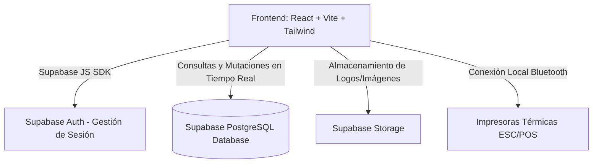
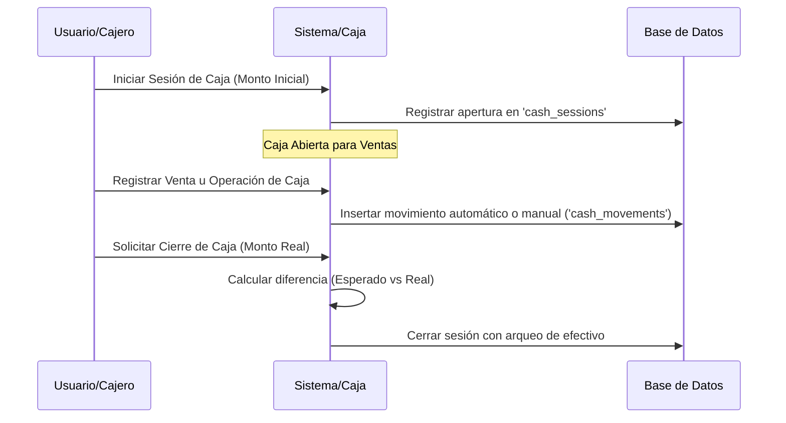
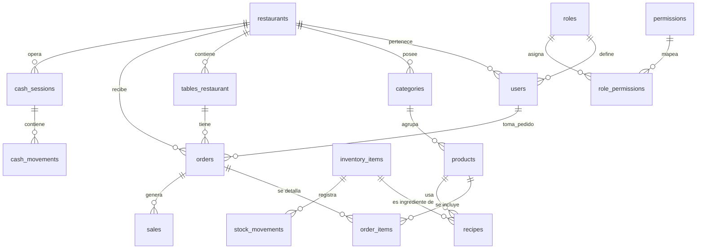

# Documento de Requerimientos de Producto (PRD) - POS Restaurante

Este documento detalla las especificaciones de producto, funcionales y técnicas del sistema **POS Restaurante**, una plataforma moderna de punto de venta y gestión interna diseñada para optimizar las operaciones de restaurantes, bares y cafeterías.

---

## 1. Información General y Objetivos

### 1.1 Resumen del Sistema
El **POS Restaurante** es una aplicación web responsiva construida con **React, Vite y Tailwind CSS**, integrada con un backend serverless en **Supabase**. Permite la administración en tiempo real de pedidos por mesa, cobro y facturación de clientes, control de flujos de caja, gestión de inventario y recetas, analíticas de ventas y un registro de auditoría completo para evitar discrepancias.

### 1.2 Objetivos de Negocio
* **Eficiencia Operativa**: Reducir el tiempo desde la toma de pedido en mesa hasta su preparación en cocina y posterior cobro en caja.
* **Control Financiero**: Evitar pérdidas monetarias mediante sesiones de caja estrictas (apertura, movimientos manuales de ingresos/egresos y arqueo de cierre).
* **Control de Stock Exacto**: Descontar ingredientes del inventario de forma automática al vender platillos preparados mediante recetas detalladas.
* **Toma de Decisiones Informada**: Proveer reportes gráficos instantáneos de ventas diarias, ganancias y rendimiento de productos para optimizar el menú.

---

## 2. Arquitectura y Stack Tecnológico

El sistema adopta una arquitectura desacoplada de alto rendimiento basada en servicios modernos:

* **Frontend**:
  - **Framework**: React 18 (utilizando renderizado del lado del cliente).
  - **Herramienta de Compilación**: Vite 6.
  - **Enrutamiento**: React Router v7 con carga diferida (*lazy loading*) de páginas para optimizar el tamaño del bundle inicial a menos de 200 KB.
  - **Estilos**: Tailwind CSS v4 para un diseño premium, fluido, responsivo y adaptado tanto a pantallas móviles (meseros) como a pantallas de escritorio (caja).
  - **Animaciones**: Motion para micro-interacciones suaves y transiciones de páginas.
  - **Librería de Componentes**: Radix UI para componentes accesibles (ventanas emergentes, diálogos, switches) combinados con iconos de Lucide React y Material Icons.
* **Backend y Base de Datos**:
  - **Plataforma**: Supabase.
  - **Base de Datos**: PostgreSQL con soporte nativo de triggers para logs de auditoría automáticos.
  - **Seguridad**: Row Level Security (RLS) habilitado por tabla para garantizar el aislamiento multitenant.
  - **Tiempo Real**: Canales de Supabase (*Realtime Channels*) para sincronizar cambios en pedidos y mesas en múltiples terminales de manera instantánea.
* **Integración de Hardware**:
  - **Impresión térmica**: Soporte nativo para impresoras térmicas de 58 mm y 80 mm a través del protocolo **ESC/POS** usando la API de Web Bluetooth de Chrome/Edge, con fallback a la impresión estándar del navegador.

---

## 3. Matriz de Roles y Permisos (Seguridad)

El sistema implementa un modelo de control de acceso basado en roles (RBAC). El rol `admin` tiene acceso irrestricto, mientras que los demás roles dependen de los permisos asignados en la tabla `role_permissions`.

| Permiso Código | Descripción | Administrador (`admin`) | Cajero (`cajero`) | Mesero (`mesero`) |
| :--- | :--- | :---: | :---: | :---: |
| `dashboard.view` | Ver métricas generales de ventas | Sí | No | No |
| `pos.view` | Ver mapa de mesas y crear pedidos | Sí | Sí | Sí |
| `cash.manage` | Abrir/cerrar caja y registrar egresos | Sí | Sí | No |
| `products.manage` | Crear y modificar productos, categorías y recetas | Sí | No | No |
| `inventory.view` | Ver stock físico e ingredientes de inventario | Sí | Sí | No |
| `reports.view` | Consultar reportes financieros detallados | Sí | No | No |
| `users.manage` | Administrar personal y sus accesos | Sí | No | No |
| `settings.manage` | Editar datos de ticket, IVA e impresoras | Sí | No | No |
| `audit.view` | Consultar bitácora de auditoría del sistema | Sí | No | No |

---

## 4. Requerimientos Funcionales por Módulo

### 4.1 Módulo de Autenticación
* **RF 4.1.1**: El usuario debe iniciar sesión ingresando su correo electrónico y contraseña registrados.
* **RF 4.1.2**: El sistema debe recuperar el perfil del usuario (`users`) y su rol correspondiente (`roles`) con sus permisos asociados inmediatamente después del login.
* **RF 4.1.3**: Si las variables de entorno de Supabase no están configuradas, el sistema debe mostrar una pantalla de advertencia amigable en lugar de un error de página en blanco.
* **RF 4.1.4**: Los usuarios deben poder actualizar su correo y contraseña desde su perfil en el apartado de configuración.

### 4.2 Módulo de Gestión de Mesas (Punto de Venta)
* **RF 4.2.1**: Mostrar una vista de rejilla o mapa físico con todas las mesas configuradas en el restaurante.
* **RF 4.2.2**: Cada mesa debe cambiar visualmente de color e indicar su estado en tiempo real:
  - **Libre**: Lista para recibir comensales (Verde).
  - **Ocupada**: Con pedido abierto activo (Rojo).
  - **Sucia**: Pendiente de limpieza para liberación (Amarillo/Naranja).
* **RF 4.2.3**: Permitir al mesero o cajero dar clic en una mesa libre para abrir una orden nueva seleccionando al mesero que atiende.

### 4.3 Módulo de Terminal POS (Detalle del Pedido)
* **RF 4.3.1**: Disponer de un menú organizado en pestañas horizontales de categorías para buscar productos rápidamente.
* **RF 4.3.2**: Al hacer clic en un producto, debe añadirse al carrito del pedido con cantidad inicial de `1`.
* **RF 4.3.3**: Permitir editar cantidades y agregar notas personalizadas para cocina (ej. "Sin cebolla", "Término medio") para cada elemento del pedido.
* **RF 4.3.4**: Calcular en tiempo real el Subtotal, el IVA (porcentaje dinámico desde la configuración) y el Total.
* **RF 4.3.5**: Soportar conversión automática de monedas si el restaurante opera en multimoneda (ej. visualizar montos en Córdoba C$ y Dólares USD según el tipo de cambio del día).
* **RF 4.3.6**: Opción de anular órdenes completas o liberar la mesa directamente si el pedido se cancela.

### 4.4 Facturación, Pagos y Validación de Stock
* **RF 4.4.1**: Al presionar "Cobrar", se debe abrir un modal de pago detallado.
* **RF 4.4.2**: El cajero debe poder seleccionar múltiples métodos de pago activos (Efectivo, Tarjeta, Transferencia, Pago Móvil) y opcionalmente el banco destino.
* **RF 4.4.3**: **Validación Financiera estricta**: El sistema no debe permitir procesar el cobro si el monto total pagado no coincide con el total de la orden, o calcular el cambio en efectivo si se excede.
* **RF 4.4.4**: **Validación de Stock (Recetas)**: Al confirmar la venta, una función del backend debe verificar que existan suficientes materias primas en el inventario para todos los ingredientes de la receta de los platillos vendidos. Si no hay stock disponible, el cobro debe bloquearse y alertar al usuario qué insumo está agotado.
* **RF 4.4.5**: Al completarse el pago, la orden cambia su estado a `completado` y la mesa pasa a estado `sucia`.

### 4.5 Control de Caja Registradora

* **RF 4.5.1**: Impedir la creación de ventas en el POS si no existe una sesión de caja abierta para el día o turno actual.
* **RF 4.5.2**: Registro de Apertura: Ingresar el monto inicial de efectivo en caja para cambio/sencillo.
* **RF 4.5.3**: Registro de Movimientos Manuales: Permitir registrar ingresos manuales (ej. cambio extra provisto) o egresos manuales (ej. compra urgente a proveedor con dinero de caja), especificando categoría y observaciones.
* **RF 4.5.4**: Monitoreo en Tiempo Real: Mostrar el saldo esperado actual calculado como: `Saldo Inicial + Ventas en Efectivo + Ingresos Manuales - Egresos Manuales`.
* **RF 4.5.5**: Cierre de Caja (Arqueo): El cajero ingresa el efectivo real que tiene físicamente. El sistema calcula la diferencia (sobrante o faltante) y archiva la sesión.

### 4.6 Catálogo de Productos y Recetas
* **RF 4.6.1**: CRUD completo de categorías y productos (nombre, descripción, precio, categoría, estado activo, indicador de si requiere control de stock).
* **RF 4.6.2**: Permitir la carga de imágenes para cada platillo directo al bucket de Supabase Storage e integrarlo con su ficha técnica.
* **RF 4.6.3**: Ficha de Recetas: Vincular un producto a múltiples insumos del inventario físico, definiendo la cantidad unitaria consumida por porción (ej. 1 Hamburguesa consume 150g de carne molida, 1 pan de hamburguesa y 20g de queso cheddar).

### 4.7 Control de Inventario y Alertas de Reabastecimiento
* **RF 4.7.1**: CRUD de insumos de inventario (nombre, unidad de medida, cantidad actual, stock mínimo para alertas y costo unitario).
* **RF 4.7.2**: Mostrar alertas visuales destacadas (colores rojos o etiquetas) para todos los insumos cuyo stock esté por debajo del mínimo configurado.
* **RF 4.7.3**: Registrar movimientos de stock manuales (compras, ajustes por merma) con su respectiva justificación y actualización automática del costo promedio de inventario.

### 4.8 Reportes de Ventas y Analíticas
* **RF 4.8.1**: Tablero de control con tarjetas de KPI clave: ventas brutas, cantidad de órdenes completadas, ticket promedio de compra y porcentaje de utilidad.
* **RF 4.8.2**: Gráfico lineal interactivo de ventas a lo largo del tiempo (agrupado por día o mes) y gráfico de barras para métodos de pago más utilizados.
* **RF 4.8.3**: Listado de los productos más vendidos ordenados por cantidad e ingresos generados.
* **RF 4.8.4**: Filtros por rango de fechas rápido (Hoy, Últimos 7 días, Mes actual, Rango personalizado).
* **RF 4.8.5**: Exportación del reporte detallado a formato Excel, CSV o PDF para control contable externo.

### 4.9 Ajustes de Sistema e Impresión de Tickets
* **RF 4.9.1**: Personalización del Ticket: Modificar el porcentaje de IVA por defecto, mensaje de agradecimiento al pie de página, tamaño del papel (58mm u 80mm) y elegir si se imprime el logotipo comercial.
* **RF 4.9.2**: Configurar datos generales del comercio (Dirección, Teléfono, Identificación Fiscal/RUC).
* **RF 4.9.3**: Integración Bluetooth: Buscar y emparejar dispositivos Bluetooth locales para mandar comandos de impresión crudos (ESC/POS) y probar la conexión con un ticket de test.
* **RF 4.9.4**: Administrar variantes de apariencia visual de la app: Modo Claro/Oscuro y presets de paleta de colores.

### 4.10 Auditoría y Seguridad
* **RF 4.10.1**: Registrar de manera automática en la tabla `audit_logs` cualquier acción crítica efectuada por el personal:
  - Creación, modificación o eliminación de productos.
  - Anulación de órdenes o ventas.
  - Aperturas y cierres de caja.
  - Ajustes manuales de inventario.
* **RF 4.10.2**: Registrar el ID del usuario, marca de tiempo exacta, tabla modificada, tipo de operación (INSERT, UPDATE, DELETE) y el detalle de cambios en formato JSON (antes vs después).

---

## 5. Diseño del Modelo de Datos (Esquema de Base de Datos)

El sistema aprovecha las restricciones de clave foránea e integridad referencial de PostgreSQL para consistencia y cascada.

### 5.1 Tablas Principales de Supabase

1. **`restaurants`**:
   - `id` (UUID, PK)
   - `nombre` (text)
   - `nombre_comercial` (text)
   - `ruc` (text)
   - `direccion` (text)
   - `telefono` (text)
   - `moneda` (text)
   - `tipo_cambio` (numeric)
   - `settings` (jsonb) -- Almacena IVA%, tamaño ticket, mensaje pie, logo flag, apariencia.
   - `logo_url` (text)

2. **`users`**:
   - `id` (UUID, PK) -- Vinculado con auth.users.id
   - `restaurant_id` (UUID, FK)
   - `nombre` (text)
   - `role_id` (UUID, FK)
   - `activo` (boolean)

3. **`roles` y `permissions`**:
   - Tablas que catalogan los roles (`admin`, `cajero`, `mesero`) y los códigos de permisos para proteger las rutas frontend y endpoints backend.

4. **`tables_restaurant`**:
   - `id` (UUID, PK)
   - `restaurant_id` (UUID, FK)
   - `numero` (text)
   - `capacidad` (integer)
   - `estado` (text) -- 'libre', 'ocupada', 'sucia'

5. **`products`**:
   - `id` (UUID, PK)
   - `restaurant_id` (UUID, FK)
   - `category_id` (UUID, FK)
   - `nombre` (text)
   - `descripcion` (text)
   - `precio` (numeric)
   - `imagen_url` (text)
   - `activo` (boolean)
   - `control_stock` (boolean)

6. **`recipes`**:
   - `id` (UUID, PK)
   - `product_id` (UUID, FK)
   - `inventory_item_id` (UUID, FK)
   - `cantidad_consumida` (numeric)

7. **`inventory_items`**:
   - `id` (UUID, PK)
   - `restaurant_id` (UUID, FK)
   - `nombre` (text)
   - `unidad_medida` (text) -- 'g', 'kg', 'unidad', 'ml', etc.
   - `cantidad_actual` (numeric)
   - `stock_minimo` (numeric)
   - `costo_unitario` (numeric)

8. **`orders` y `order_items`**:
   - Cabecera del pedido (mesero_id, mesa_id, estado: 'abierto'|'completado'|'anulado', observaciones).
   - Detalle de ítems (producto_id, cantidad, precio_unitario, subtotal, notas_cocina).

9. **`sales`**:
   - `id` (UUID, PK)
   - `order_id` (UUID, FK)
   - `subtotal` (numeric)
   - `iva` (numeric)
   - `total` (numeric)
   - `metodo_pago` (text)
   - `detalles_pago` (jsonb) -- Almacena referencias de pago, bancos, propinas, etc.

10. **`cash_sessions` y `cash_movements`**:
    - Sesión de caja por cajero (monto_inicial, monto_final_real, diferencias, estado: 'abierta'|'cerrada').
    - Detalle de entradas/salidas (monto, tipo: 'venta'|'ingreso'|'egreso', motivo, session_id).

11. **`audit_logs`**:
    - Bitácora automatizada de auditoría (user_id, operacion: 'INSERT'|'UPDATE'|'DELETE', tabla_nombre, registro_id, valor_anterior, valor_nuevo).

---

## 6. Plan de Verificación y Control de Calidad (QA)

### 6.1 Casos de Prueba Críticos

1. **Flujo de Venta Completo con Recetas**:
   - *Entrada*: Crear orden para Mesa 5, agregar "Hamburguesa Clásica" (requiere 150g de carne molida).
   - *Procedimiento*: Pagar la orden por el total correspondiente en efectivo.
   - *Resultado esperado*: La mesa pasa a estado `sucia`, el inventario reduce exactamente 150g de "Carne Molida", y el log de movimientos de stock registra la salida. La caja incrementa el saldo esperado en el valor cobrado.

2. **Bloqueo por Stock Insuficiente**:
   - *Entrada*: Tratar de ordenar un producto cuya receta requiere ingredientes que están en cantidad menor a la necesaria.
   - *Procedimiento*: Intentar completar el pago en el POS.
   - *Resultado esperado*: El sistema emite un error indicando "Stock insuficiente del ingrediente X" y bloquea la creación de la venta, manteniendo el inventario y la caja intactos.

3. **Cuadre de Caja con Egresos**:
   - *Entrada*: Caja abierta con C$ 1,000. Se registra egreso manual de C$ 200 por insumos. Se realiza una venta de C$ 500.
   - *Procedimiento*: Solicitar cierre de caja declarando C$ 1,300 en efectivo físico.
   - *Resultado esperado*: El sistema calcula saldo esperado C$ 1,300. Diferencia = C$ 0. Cierra la sesión exitosamente.

4. **Validación de Pago Incorrecto**:
   - *Entrada*: Orden por C$ 450.
   - *Procedimiento*: Registrar pago con C$ 400. Intentar guardar.
   - *Resultado esperado*: El sistema muestra mensaje de error "El monto total pagado debe igualar el total de la orden" y no permite guardar.

5. **Prueba de Impresión Bluetooth**:
   - *Entrada*: Conectar impresora ESC/POS habilitando Bluetooth.
   - *Procedimiento*: Presionar "Imprimir prueba" en configuración.
   - *Resultado esperado*: Se manda el buffer de bytes ESC/POS al dispositivo físico y se imprime correctamente el ticket de prueba formateado.
